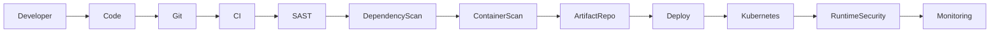
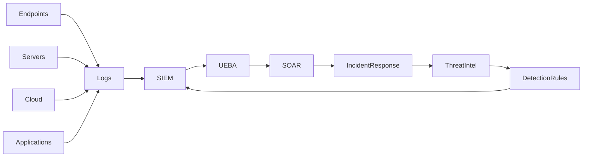
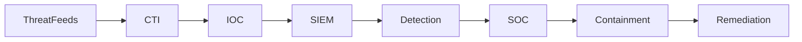

### Ajay Gandikota 
SOC Architecture • DevSecOps • Threat Intelligence • Security Automation

---

# 🚀 Cybersecurity Stack

## 🛡 Security Platforms

---

## ⚙️ Security Automation & Scripting

---

## ☁️ Cloud & Infrastructure

---

## 🧠 DevSecOps Toolchain

---

# 🧠 DevSecOps Security Pipeline

---

# 🛡 SOC Security Architecture

---

# 🛰 Threat Intelligence Pipeline

---

# 🔐 Cybersecurity Tools

| Domain                   | Tools                                |
| ------------------------ | ------------------------------------ |
| SIEM                     | Elastic SIEM, Splunk, Wazuh, Graylog |
| SOAR                     | Cortex XSOAR, Shuffle, TheHive       |
| Vulnerability Management | Nessus, OpenVAS, Nuclei              |
| Web Security             | Burp Suite, OWASP ZAP                |
| Threat Intelligence      | MISP, OpenCTI, VirusTotal            |
| Identity Security        | Keycloak, MFA, FIDO2                 |
| DevSecOps Security       | Trivy, Semgrep, CodeQL               |
| Monitoring               | Prometheus, Grafana                  |

---

# 🔥 Cybersecurity Projects

## Cyber Infrastructure Management Platform

* SIEM
* SOAR
* UEBA
* IAM
* Patch Management
* Asset Management
* Threat Intelligence
* Vulnerability Scanner

---

## Enterprise NAC Deployment

* PacketFence NAC
* 35,000+ endpoints
* Active-Active Architecture
* Scalable to 100k endpoints

---

## Threat Intelligence & Vulnerability Platform

* IOC correlation
* STIX / TAXII feeds
* Automated vulnerability detection
* Security analytics

---

# 📊 GitHub Stats

---

# 📡 Connect With Me

Email: **[ajaygandikota773@gmail.com](mailto:ajaygandikota773@gmail.com)**
LinkedIn: **[https://linkedin.com/in/gandikota-ajay-lk](https://linkedin.com/in/gandikota-ajay-lk)**

---

# ⚡ Cybersecurity Philosophy

> Automate Defense
> Correlate Intelligence
> Detect Threats Early
> Respond Instantly

