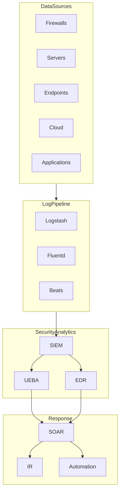
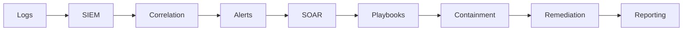

# 🛡️ Ajay Gandikota — Cybersecurity & DevSecOps Architect

````markdown
<div align="center">

# 🛡️ Ajay Gandikota
### Senior System Engineer — Cybersecurity

SOC Architecture • DevSecOps Security • Threat Intelligence • Security Automation


</div>

---

# ⚡ Cybersecurity Command Center

```mermaid
flowchart LR

User --> Application
Application --> API
API --> WAF

WAF --> SIEM
SIEM --> UEBA
UEBA --> SOAR

SOAR --> Response
Response --> ThreatIntel

ThreatIntel --> SIEM
````

---

# 🚀 DevSecOps Security Pipeline

```mermaid
flowchart LR

Developer --> Code
Code --> GitRepo

GitRepo --> SAST
SAST --> DependencyScan
DependencyScan --> ContainerScan

ContainerScan --> Build
Build --> ArtifactRepo

ArtifactRepo --> Deploy

Deploy --> RuntimeSecurity
RuntimeSecurity --> Monitoring

Monitoring --> SIEM
SIEM --> SOAR
SOAR --> IncidentResponse
```

---

# 🧠 SOC Architecture



---

# 🧩 Cybersecurity Platforms

| Platform         | Capabilities                  |
| ---------------- | ----------------------------- |
| SIEM             | Log analysis, detection rules |
| SOAR             | Automated response playbooks  |
| UEBA             | Behavior analytics            |
| IAM              | Identity security             |
| NAC              | Network access control        |
| CTI              | Threat intelligence           |
| Patch Management | Vulnerability remediation     |

---

# 🧰 Security Tools Ecosystem

## 🔍 Vulnerability Management

```
Nessus
OpenVAS
Nuclei
Nikto
Burp Suite
OWASP ZAP
SQLMap
```

---

## 🛡️ Security Monitoring

```
Elastic SIEM
Splunk
Wazuh
Graylog
Security Onion
```

---

## 🤖 SOAR & Automation

```
Cortex XSOAR
Shuffle
n8n
TheHive
```

---

## 🐳 DevSecOps Security

```
SAST
Semgrep
SonarQube
CodeQL

DAST
OWASP ZAP
Burp Suite

Container Security
Trivy
Clair
Grype

Secrets Detection
TruffleHog
Gitleaks
```

---

# ☁️ Cloud Security

```
AWS GuardDuty
AWS Inspector
AWS Security Hub

Azure Defender
Azure Sentinel

GCP Security Command Center
```

---

# 🔐 Identity & Access Security

```
Keycloak
Okta
Auth0

FIDO2 Authentication
Multi-Factor Authentication
Adaptive Authentication
```

---

# ⚙️ Security Automation Stack

```
Python
Bash
PowerShell
Ansible
Flask
FastAPI
```

Automation is used for:

* Threat detection
* IOC enrichment
* Vulnerability scanning
* Patch deployment
* Incident response

---

# 🧬 Threat Intelligence Platform

Threat feeds integrated with SOC:

```
MISP
OpenCTI
VirusTotal
AlienVault OTX
AbuseIPDB
```

Protocols used:

```
STIX
TAXII
IOC Correlation
Threat Fingerprinting
```

---

# 🛰️ Security Monitoring Pipeline



---

# 🧪 Security Testing

```
VAPT
SAST
DAST
API Security
Web Application Security
Network Penetration Testing
```

---

# 🧱 Infrastructure & Platforms

```
Linux (Debian, Fedora)
Windows
macOS

Virtualization
VMware
Proxmox

Containers
Docker
Kubernetes
```

---

# 📊 Security Skills Matrix

| Domain              | Skills                              |
| ------------------- | ----------------------------------- |
| SOC                 | Threat Detection, Incident Response |
| Cloud Security      | AWS, Azure, GCP                     |
| DevSecOps           | Secure CI/CD                        |
| Automation          | Python, Ansible                     |
| IAM                 | SSO, MFA                            |
| Threat Intelligence | STIX/TAXII                          |
| Infrastructure      | Linux, HA systems                   |

---

# 🔥 Major Security Projects

## Cyber Infrastructure Management Platform

Modules

```
SIEM
SOAR
UEBA
IAM
Patch Management
Asset Management
Threat Intelligence
Vulnerability Scanner
```

---

## Enterprise NAC Deployment

```
PacketFence NAC
35,000+ endpoints
Active-Active Architecture
Scalable to 100k endpoints
```

---

## Threat Intelligence & Vulnerability Platform

```
Real-time threat feeds
IOC correlation
Automated vulnerability detection
Security analytics
```

---

# 📈 GitHub Stats

```markdown


```

Replace **USERNAME** with your GitHub username.

---

# 📡 Connect With Me

```
Email: ajaygandikota773@gmail.com
LinkedIn: linkedin.com/in/gandikota-ajay-lk
```

---

# ⚡ Cybersecurity Philosophy

> Automate Defense
> Correlate Intelligence
> Detect Threats
> Respond Instantly

```

---

