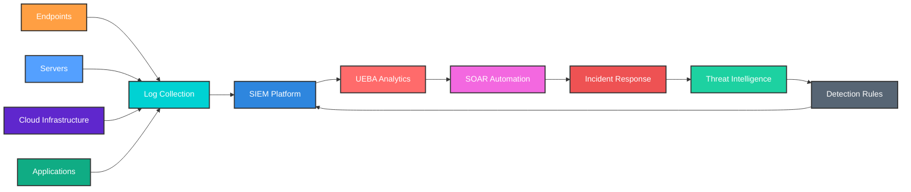
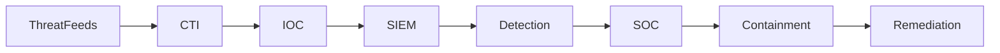

  

# Technology Stack

# DevSecOps Security Pipeline

# SOC Security Architecture

# Threat Intelligence Pipeline

# Cybersecurity Tools

| Domain                   | Tools                                |
| ------------------------ | ------------------------------------ |
| SIEM                     | Elastic SIEM, Splunk, Wazuh, Graylog |
| SOAR                     | Cortex XSOAR, Shuffle, TheHive       |
| Vulnerability Management | Nessus, OpenVAS, Nuclei              |
| Web Security             | Burp Suite, OWASP ZAP                |
| Threat Intelligence      | MISP, OpenCTI, VirusTotal            |
| Identity Security        | Keycloak, MFA, FIDO2                 |
| DevSecOps Security       | Trivy, Semgrep, CodeQL               |
| Monitoring               | Prometheus, Grafana                  |

# Cybersecurity Projects

## Cyber Infrastructure Management Platform

* SIEM
* SOAR
* UEBA
* IAM
* Patch Management
* Asset Management
* Threat Intelligence
* Vulnerability Scanner

## Enterprise NAC Deployment

* NAC
* 35,000+ endpoints
* Active-Active Architecture
* Scalable to 100k endpoints

## Threat Intelligence & Vulnerability Platform

* IOC correlation
* STIX / TAXII feeds
* Automated vulnerability detection
* Security analytics

# Connect With Me

LinkedIn: **[https://linkedin.com/in/gandikota-ajay-lk](https://linkedin.com/in/gandikota-ajay-lk)**

## ☕ Support My Work

If you find my **Cybersecurity Tools, DevSecOps Projects, and Research** useful, you can support my work.

  

